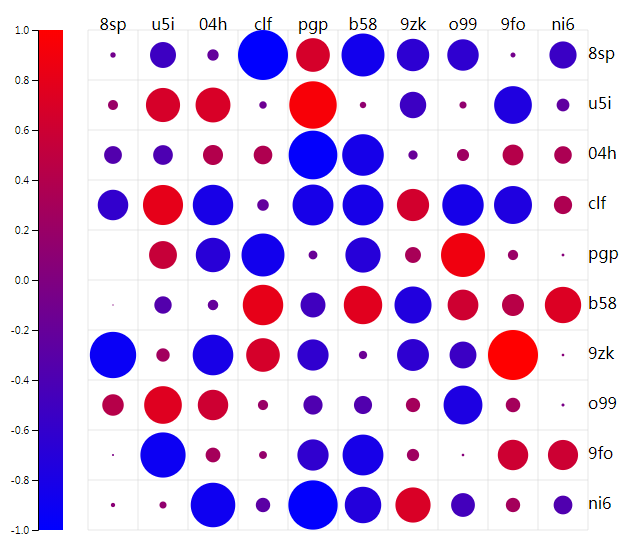

# relationMatrix 相关性矩阵



The circle's radius and color is both up to the realtion value, you can change the source code to meet your needs.  
圆圈半径和颜色程度同时刻画了相关性的大小，你也可以自定义。  
The file offered a function `relationMatrix` with one parameter `options`, its properties is below:  
使用D3.js编写了`relationMatrix.js`，该文件提供一个函数`relationMatrix`, 函数需要传入一个参数`options`, 默认配置如下：  

```js
    options = {
        margin: { top: 50, right: 50, bottom: 100, left: 100 }, // 边缘
        data: [],  // 数据，二维数组的格式
        container: "canvas", // 需要绘入图表的DOM元素的ID
        labels: [], // 标签数组
        max: {
            color: "red", // 最大颜色
            value: 1 // 最大值
        },
        min: {
            color: "blue" // 最小颜色
            value: -1 // 最小值
        },
        cellSize: 60, // 每个格子的大小
        isSymmetry: true // 是否对称
    }
```

**注意：** 这里的是否对称`isSymmetry`是指最大值和最小值是否是以`0`为界，正负对称，这决定圆圈半径的选取方式。例如皮尔逊相关系数在`-1`和`1`之间。*不是指矩阵是否对称，矩阵完全由输入的`data`值决定*。  
**Note:** The property `isSymmetry` is not for `Symmetric Matrix`, but for "Is the maximum and minimum is bounded by zero, one positive and one negative".As we know, Pearson correlation coefficient (PCC) is between `1` and `-1`.

After import `relationMatrix.js`, a "HOW TO USE" example is below:  
在自己的页面引入`relationMatrix.js`后，一个调用的例子如下：  

```js
    // test Data
    function makeArray(length){
        let result = [];
        for(let i = 0; i < length; i ++){
            let array_i = [];
            for(let j = 0; j < length; j ++){
                array_i.push(Math.random() * 2 - 1);
            }
            result.push(array_i);
        }
        return result;
    }
    function makeLabel(length){
        let result = [];
        for(let i = 0; i < length; i ++){
            result.push(Math.random().toString(36).slice(-3));
        }
        return result;
    }
    var options = {
        margin: { top: 50, right: 50, bottom: 100, left: 100 },
        data: [],
        container: "canvas",
        labels: [],
        max: {
            value: 1
        },
        min: {
            value: -1
        },
        cellSize: 60,
        isSymmetry: true
    }
    function paint(){
        var num = 10;
        options.data = makeArray(num);
        options.labels = makeLabel(num);
        relationMatrix(options);
    }
    paint();
```
